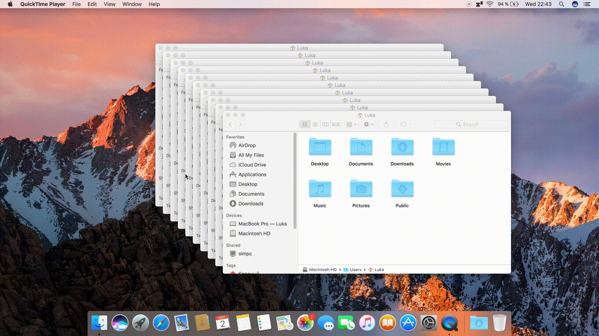

# macOS Sierra on ASUS Zenbook UX303*

## Changelog
#### 2 November 2016
* Initial release

## Important notes
* Since I only own a maxed out [UX303UB](ux303ub-c4032t) with QHD+ display, some things may not work as intended if you follow this guide yet own a different model. At the very least, if you happen to own a different model, [you should generate a new ssdt](https://www.tonymacx86.com/threads/guide-native-power-management-for-laptops.175801/). If this happens to be the case, feel free to open an issue, and I'll try to help.
* The integrated Intel Wifi card does not work on macOS, and therefore you need to replace it with a broadcom one, I'm using a BCM94352Z / DW-1560 card. As a result of this, you might need to patch Wifi yourself if you happen to be using another Wifi card.
* Many models include a dedicated GPU (usually Nvidia GT840M or GT940M). These will **not** work with macOS at all, which means you're stuck with intel's integrated graphics.
* Sleep doesn't work fully. **See the "Sleep" section.**
* Apart from tapping and scrolling, **no gestures work as of sierra.**
* I'll gladly update the repo if someone finds patches / kexts / other things which make the system more stable.

## Overview
#### What works?
* Audio
* Battery indicator
* Camera
* Card reader
* Keyboard
* Power management
* Sleep
* Touchscreen
* Trackpad

#### Usability

The Intel HD 520 is by no means a bad GPU, however, running macOS on QHD+ resolution scaled to 1600x900 means it has to push 4 times the pixels, and therefore it chugs sometimes. See for yourself:

(Note: these are not accurate representations since they were recorded using QuickTime and since they're gifs)

However, these chugs were never bad enough to really bother me, and at least you're getting something that looks realy nice (~280 PPI).

### Performance & Battery life

 Performance was similar to Linux and Windows, apart from, of course, gaming, which was close to impossible on macOS, due to the lack of support for the 940M GPU and DirectX. Battery life was average, 4~5 hours of use in total. I'm not sure, but the 940M might still be drawing power, even though it is not utilized. If this is the case, a better DSDT / SSDT patch might disable it fully and therefore give better battery life.

### Sleep

Sleep works well when the device is running of of battery power. If it's put to sleep when it's charging, it's unable to wake up and requires a full reboot. For now I'm using [NoSleep](https://www.macupdate.com/app/mac/37991/nosleep) to disable sleep completely when on AC power, however, even this isn't enough, and the device still gets stuck.

 ### Keyboard

I've modified the keyboard driver a bit. This is what I've changed / added:
* 16 level keyboard backlight
* Auto disable keyboard backlight after 10 sec.
* Pressing ⇧+⇪+F will allow you to use the function keys (i.e. volume, brightness, etc.) without having to use the fn button (I'm still looking for a way to do this automatically on boot)

### Touchpad

I have added gestures similar to what you would find on a regular MacBook, as well as modified the scroll settings to make them feel more natural.. **However**, since Sierra, I'm unable to get these to work. Anyways, here they are:

| Gesture | Action |
| ------- | ------ |
| 2 finger slide in from right | Notification Center
| 3 finger tap | Info |
| 3 finger swipe (left / right) | Forward / Backward1 |
| 4 finger swipe (left / right) | Switch spaces |
| 4 finger swipe up | Mission Control |
| 4 finger swipe down | Application Windows |
| 5 finger pinch | launchpad |

The touchpad section in System Preferences does not work in Sierra, and I've therefore provided a rollback prefpane file from El Capitan. Put it in `/System/Library/PreferencePanes`

### Wifi (BCM94352Z)

Wifi was hell to set up in macOS 10.12.1. I tried every combination of kext patches in clover, but none seemed to work. I finally figured it out, and modified the info.plist of the Brcm94360 kext, and now it's working. I have provided the modified `IO80211NetworkingFamily` kext, so replace the old one in  `/System/Library/Extensions`, repair permissions with [InsanelyRepairPermissions](http://www.insanelymac.com/forum/files/file/432-insanelyrepairpermission/), rebuild the kextcache, reboot and you're done!
